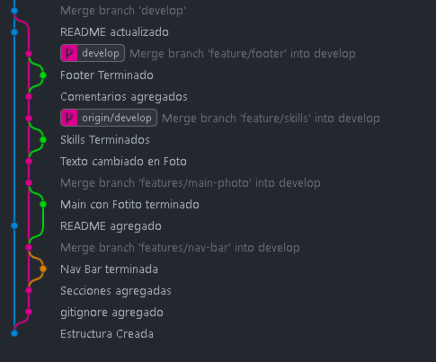

# Portafolio

## Este es un Proyecto de Front-End para el Capstone N°2 del Curso de Desarrollo Web de Udemy

## FALTA AGREGAR LOS PROYECTOS, LOS ICONOS DE LAS SKILLS (SVGs hdp), HACER BIEN EL FOOTER, Y EL CONTACTO

queda para más tarde jiji
me estoy inspirando de [este](https://coding-with-truong-portfolio-2.vercel.app/#home)

## Foto del Git Flow

- Azul: main
- Rosa: Develop
- Verde/Amarillo: feature